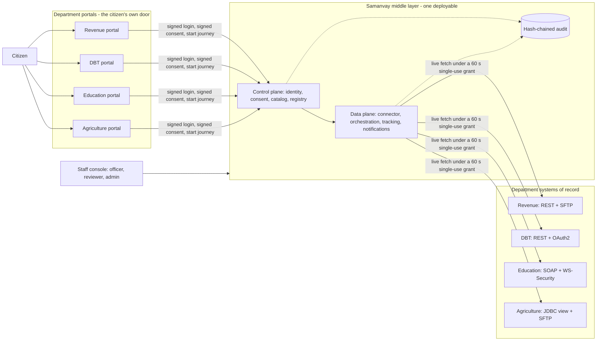
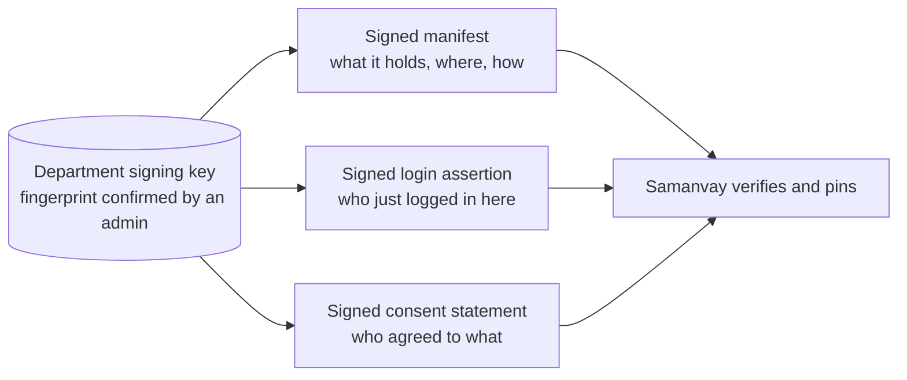
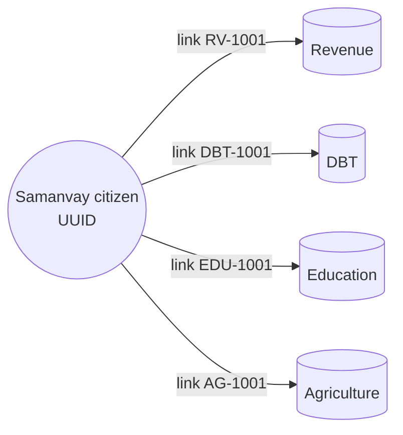
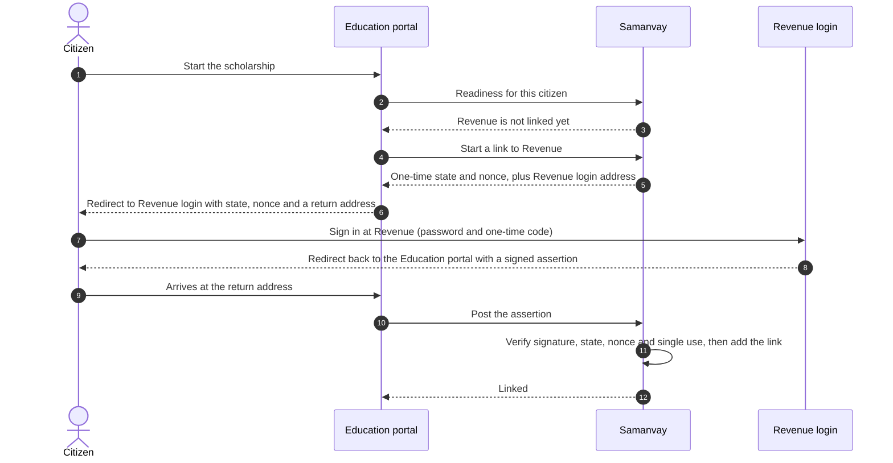
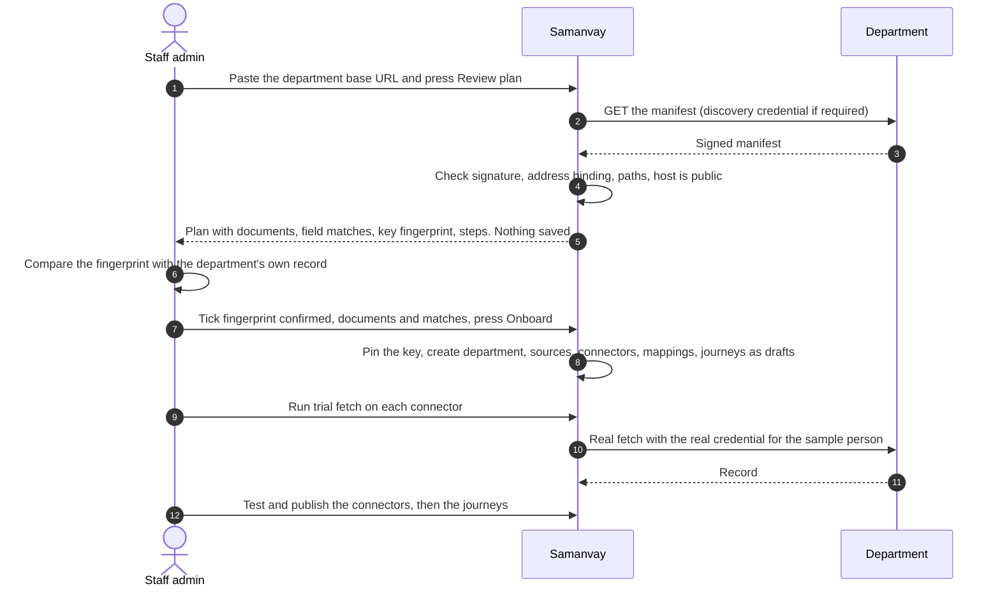
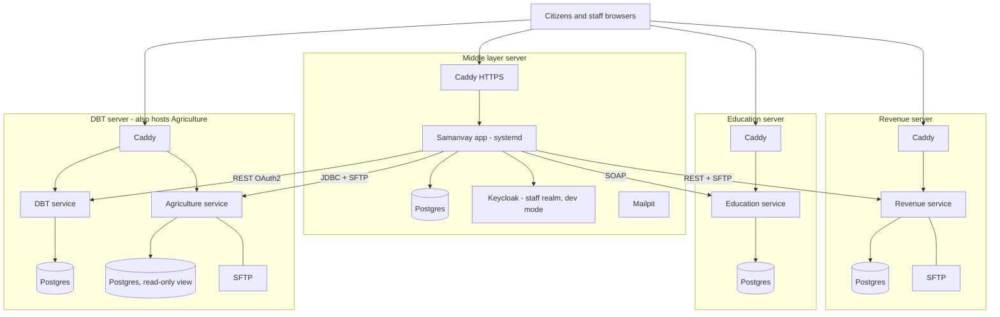

# Samanvay

**Government Digital Platform Interoperability & Federated Service Delivery Platform**

SIH26129 — *System integration and interoperability among government digital platforms,
resulting in fragmented service delivery* · Government of Maharashtra

---

> **The platform does not centralize government data. It makes distributed government data
> discoverable, accessible and interoperable under explicit authorization.**

Samanvay is an interoperability platform, not a service portal. Government departments keep
ownership of their data; Samanvay owns only the *interoperability state* — identity links,
consent, discovery metadata, workflow, tracking, audit and mappings.

Citizen journeys (post-matric scholarship, farmer subsidy, income certificate renewal, DBT bank account seeding) run on **each department's own
portal**, not on Samanvay: Samanvay has no citizen sign in and no citizen screens. The department's portal calls Samanvay behind the scenes, with
the citizen's consent (signed by the department). The journeys exist as **evidence that the platform is generic**, not as the product.

## Live demo & one-click access (for judges)

**Live:** <https://app.3.109.201.126.nip.io/app/> — demo data only; nothing here is a real record.

There is **no demo login**: everyone signs in through Keycloak.

- **Citizens** do not use Samanvay. They sign in on a department's own portal (`https://<department>/portal/`) with that department's
  mobile number, password and one-time code; when a service needs another department's records they log in at that department's own login.
- **Staff** use the ready-made accounts `dev-officer`, `dev-reviewer` and `dev-admin` (temporary password `<user>-change-me`):
  the first sign-in asks for a new password and for an authenticator code (TOTP) to be enrolled, as for any real staff
  account. A passkey also works.

**The four department portals** (each is the department's own citizen front door; a service starts here, not on Samanvay):

| Department | Portal | Service offered there | Protocol Samanvay uses to reach it |
|---|---|---|---|
| Revenue | <https://revenue.43.204.63.20.nip.io/portal/> | Income certificate renewal | REST + SFTP |
| DBT | <https://dbt.13.127.73.197.nip.io/portal/> | DBT bank account seeding | REST + OAuth2 |
| Education | <https://education.13.202.195.55.nip.io/portal/> | Post-matric scholarship | SOAP + WS-Security |
| Agriculture | <https://agriculture.13.127.73.197.nip.io/portal/> | Farmer subsidy | JDBC (read-only view) + SFTP |

Each portal signs in with a mobile number, that department's password and a one-time code. The demo citizens and their passwords are
issued by the maintainers and are not published here. A department's services only work once an admin has onboarded that department
(staff console, *Onboarding*), and a scholarship or farmer-subsidy application needs every department it draws from to be onboarded.

| Open this | Sign in as | What to look at |
|---|---|---|
| [`/app/#/staff/admin/onboarding`](https://app.3.109.201.126.nip.io/app/#/staff/admin/onboarding) | `dev-admin` | Onboard a department from just its URL; it picks up the department's documents **and its services (journeys)**; "Run trial fetch" |
| [`/app/#/staff/admin/schemas`](https://app.3.109.201.126.nip.io/app/#/staff/admin/schemas) | `dev-admin` | The **central schema** the departments' fields are matched onto; add a schema or a new version |
| [`/app/#/staff/admin/departments`](https://app.3.109.201.126.nip.io/app/#/staff/admin/departments) and [`/app/#/staff/admin/journeys`](https://app.3.109.201.126.nip.io/app/#/staff/admin/journeys) | `dev-admin` | The onboarded **Departments** and **Journeys**; each journey's **readiness** is computed from real connector availability; publish a ready one |
| [`/app/#/staff/officer/exceptions`](https://app.3.109.201.126.nip.io/app/#/staff/officer/exceptions) | `dev-officer` | Exception queue, retries, bank-account review, live ops metrics |
| [`/app/#/staff/reviewer/queue`](https://app.3.109.201.126.nip.io/app/#/staff/reviewer/queue) | `dev-reviewer` | The identity-matching review queue (machines propose, humans dispose) |

The `#` in the staff URLs matters — the app uses hash routing. The **citizen** experience is each department's own portal
(`/portal/` on the Revenue, DBT, Education and Agriculture servers; see `deploy/README.md`). Staff open **Journeys, then a journey's Status**
(`/app/#/staff/admin/journeys/<code>`) to see whether it is connected and working, with its middle-layer log.

## Contents

1. [The problem and the idea](#the-problem-and-the-idea)
2. [Architecture at a glance](#architecture-at-a-glance)
3. [How a department portal works: our assumptions, and what they changed in the middle layer](#how-a-department-portal-works-our-assumptions-and-what-they-changed-in-the-middle-layer)
4. [What a department has to implement](#what-a-department-has-to-implement)
5. [Protocols and the security each one is handled with](#protocols-and-the-security-each-one-is-handled-with)
6. [How a citizen is linked across departments](#how-a-citizen-is-linked-across-departments)
7. [How a department is onboarded](#how-a-department-is-onboarded)
8. [The Journeys dashboard: is a journey connected, and what did the middle layer do](#the-journeys-dashboard-is-a-journey-connected-and-what-did-the-middle-layer-do)
9. [The edges we handle](#the-edges-we-handle)
10. [Decisions and trade-offs](#decisions-and-trade-offs)
11. [Feasibility, viability and what staff can see](#feasibility-viability-and-what-staff-can-see)
12. [How it is deployed today](#how-it-is-deployed-today)
13. [Internal working](#internal-working)
14. [Security and sensitivity](#security-and-sensitivity)
15. [Future scope, including where AI genuinely helps](#future-scope-including-where-ai-genuinely-helps)

## The problem and the idea

A Maharashtra citizen who applies for a scholarship needs an income and a caste certificate (Revenue), a marks statement (Education) and a
verified bank account (DBT). Each lives in a different department system with its own protocol, login and security scheme. Today the citizen
carries paper between counters, or each pair of departments builds its own integration (up to N x N for N departments).

Samanvay is the **middle layer** that removes that work without replacing any department system:

- Departments stay the **system of record**. Samanvay never stores a certificate, mark or bank number. It fetches live, under consent, and keeps
  only the *interoperability state*: who the citizen is at each department, what they consented to, how each department's fields map onto one
  central schema, the workflow, the tracking reference and a tamper-evident audit trail.
- A department joins by **publishing a signed manifest** (what it holds and how to reach it), not by changing its system.
- **Samanvay has no citizen screens and no citizen login.** The citizen stays on the department's own portal. That portal calls Samanvay behind
  the scenes, and the department itself vouches for who the citizen is and signs their consent.

## Architecture at a glance



The control plane decides (identity, consent, catalog, registry); the data plane moves (connector, orchestration, tracking, notifications). No
fetch happens without a grant the control plane issued, and module boundaries are enforced at build time (Spring Modulith and ArchUnit).

## How a department portal works: our assumptions, and what they changed in the middle layer

The four departments in `departments/` are separate Spring Boot services with fake data, built to look like real systems (own database, own
protocol, own security, own login). Each also serves a **citizen portal** at `/portal/`. These are the assumptions we made about a department and
its portal, and what each one forced us to build or change in Samanvay.

| # | Assumption about the department | What it changed in the middle layer |
|---|---|---|
| A1 | The citizen already has an account and trusts the department's **own login and portal**. We will not ask them to sign in somewhere new. | Samanvay has **no citizen login or citizen UI**. The citizen identity provider (a Keycloak realm) is optional and switched off in the deployment. Samanvay learns who the citizen is only from the department. |
| A2 | The portal has a **server side** (a back end for the front end) that can keep a secret and call Samanvay. The browser never talks to Samanvay and never holds a Samanvay token. | Each department gets its own Keycloak **client-credentials client** (`dept-<code>`) with the `department` claim. Every `/api/department/**` call is scoped to the caller's department (`DepartmentScope`): it can only start the journeys it runs, only for citizens linked to it. A citizen who is not its own is simply not found (404), not "forbidden". |
| A3 | The department can hold a **signing key** and sign two small statements: "this person just logged in here" and "this person agreed to this use". | Samanvay verifies a department-signed **login assertion** (ES256 JWT, one-time `jti`) against the key an admin pinned at onboarding, and stores the department-signed **consent statement** as evidence. It no longer records consent itself. |
| A4 | The department knows its own **person ID** for the citizen but not Samanvay's citizen ID. | A Samanvay citizen record is created or found from the assertion; a **link** maps it to the department's person ID. Departments never see each other's person IDs (the readiness call returns only which departments are linked). |
| A5 | A service is started **on the department that offers it** (Education offers the scholarship) and that department is the *requester* of its own journeys. | Journeys are owned by a requester department. The portal calls `readiness`, then `consent`, then `start`. Samanvay's staff pages show journeys under their requester. |
| A6 | A service may need records from **other** departments, and the citizen must prove they control those accounts too. | The **link flow**: the portal asks Samanvay for a one-time `state` and `nonce`, sends the citizen to the other department's own login with a return address, and posts back the other department's signed assertion. Return addresses are allow-listed per department. |
| A7 | The department keeps its own **session**. | The shared kit (`departments/kit`) uses a signed, expiring, `HttpOnly` cookie with no server session. Throttling, request hygiene and security headers live in the kit. |
| A8 | A department outage is normal and must not lose the citizen's application. | Orchestration records each document as a step. A source that is down leaves the step *pending source* and raises an exception for an officer; a retry fills the gap. |
| A9 | Departments publish what they hold in a **manifest** they sign and control. | Onboarding is manifest-driven (see below); the manifest carries documents, protocols, parameter *names* (never values), the journeys the department offers, its `portalUrl`, and its `identity` block (login URL, public keys). |
| A10 | Departments do not want to rename their fields or change their database. | A **central schema** per document and a field **mapping** layer: each department's fields are matched to central fields, the journey is written once against the central schema. |

### The four departments

| | Revenue | DBT | Education | Agriculture |
|---|---|---|---|---|
| Documents | income, caste, domicile certificates; 7/12 land record | bank account | marks statement | farmer record; crop sowing record |
| Protocol | REST + SFTP batch CSV | REST | SOAP 1.1 | JDBC (read-only view) + SFTP batch CSV |
| Journey it offers | Income certificate renewal | DBT bank account seeding | Post-matric scholarship | Farmer subsidy |
| Journey draws on | income certificate | bank account | income and caste (Revenue), marks (Education), bank account (DBT) | land parcel (Revenue), crop record (Agriculture), bank account (DBT) |
| Quirk | certificates are keyed by certificate number, so a **resolve** step finds the latest key first; also demands a discovery credential to even show its manifest | OAuth2 token before each fetch; returns an account reference and a masked IFSC, never the full number | SOAP envelope and XML answer | no API at all: the manifest names a view and its key column and **no SQL**; Samanvay builds a fixed, parameterised `SELECT` |

## What a department has to implement

The burden is mostly *attesting*, not integrating.

| # | What | Why | Effort |
|---|---|---|---|
| 1 | **Publish `GET /.well-known/samanvay/manifest`** (v2): documents and fields, how to reach each, parameter names, resolve step if needed, journeys, `identity` block | Samanvay can onboard it from one URL | A document and a key |
| 2 | **Sign the manifest** (ES256, `X-Samanvay-Signature`, over the document hash, issue time and the department's own address) | The admin pins the key once; anything else is refused | One key file |
| 3 | **Keep serving its data** over REST, SOAP, SFTP or a read-only JDBC view, and issue Samanvay a read-only credential | Samanvay fetches live | None if it already exposes the data |
| 4 | **After its own login, send a signed assertion** (`POST /api/department/citizens/resolve`, with its client credentials) | Links the citizen to the department's person ID | One signed JWT per sign-in |
| 5 | **Show the consent wording, and sign the confirmation** (a `samanvay-consent` JWS: purpose, categories, one-time nonce) | Only the department can attest the citizen agreed | One signed statement per consent |
| 6 | **Offer its journey on its own portal** and call Samanvay to start it | The citizen stays on the department they trust | The kit provides it |

For a Spring Boot department steps 4 to 6 are the shared kit. A department on another stack implements the same small contracts:
[department API](docs/contracts/department-api.md), [login assertion](docs/contracts/login-assertion.md),
[consent statement](docs/contracts/department-consent-statement.md), [manifest signature](docs/contracts/manifest-signature.md).
The department does **not**: change its database, adopt a new identity system, build a screen for Samanvay, expose a new API or share data in bulk.

## Protocols and the security each one is handled with

| Protocol | What the department requires | How Samanvay satisfies it | What Samanvay checks about itself |
|---|---|---|---|
| **REST + API key** (Revenue) | `X-Api-Key` header, optionally an IP allow-list | The key is read from the secret store at call time and sent as the header | The request URL is on the registered origin, the answer is capped at 1 MB, deadline, retry, circuit breaker |
| **REST + OAuth2** (DBT) | Client-credentials token, then a bearer header | Fetches a token, caches it, sends the bearer, refreshes on a 401 | Token URL is validated like any endpoint |
| **SOAP + WS-Security** (Education) | UsernameToken (username and password) in the SOAP header | Builds the envelope and header, parses the XML answer | Endpoint path is validated, answer capped |
| **SFTP batch CSV** (Revenue, Agriculture) | Username and password; a host key | Password from the secret store; the server's **host key is pinned** (no trust on first use) | A different host key fails the fetch; the CSV is read by key (person ID) |
| **JDBC** (Agriculture) | A database account | A **read-only role that can read exactly one view**; the manifest names the view and key column, never SQL | A guard allows a parameterised `SELECT` only |
| **The manifest itself** | Optionally a discovery credential (`X-Discovery-Key`) before it shows the manifest | Sent from the secret store | Signature verified against the pinned key, bound to the department's own address (`aud`), checked for age |

Secrets (every credential above) live in the secret store and are never typed into the console, never stored in the database and never logged.
Every department-facing and staff-facing route is behind a token and listed in a test with the roles allowed.

Trust between Samanvay and a department rests on three signed things, all checked against a key a human pinned once:



## How a citizen is linked across departments

There is **no national ID** and no central citizen database. The same person has a different identifier at every department (Revenue `RV-1001`,
DBT `DBT-1001`, Education `EDU-1001`, Agriculture `AG-1001` in the demo). Samanvay keeps a citizen record of its own (a random UUID and a display
name) and a set of **links** from it to the person's ID at each department.



**Step 1. Home sign-in (the first link).** The citizen signs in on a department's portal. The portal's back end sends Samanvay a signed
assertion; Samanvay verifies it against the pinned key, accepts it once, and creates or finds the citizen with a link to that department.

**Step 2. Linking another department (when a service needs it).**



**Step 3. The same human twice.** If the person had already signed in at the second department on their own, there are two Samanvay records for one
human. When a link proves they are the same person, the records are **merged**: links move to the surviving record and the registry pointers are
recreated. A record that already has applications or consents is never merged silently.

**Step 4. Weak evidence only proposes.** A name and date-of-birth match without a login only creates a **candidate**. A human reviewer confirms or
rejects it in the reviewer queue. A probabilistic match never becomes an active link by itself.

### The same idea for documents

Each department names fields differently (`annualIncome`, `income_inr`, `ANNUAL_INC`). Samanvay has a **central schema per document type**
(for example `Credential/Income@1`) with required fields. At onboarding every department field is **matched** to a central field (the system
proposes, an admin approves), and a connector converts the answer to the central shape. A journey is written once against the central schema and works
with any department that provides that document. The staff console's **Central schema** page shows, document by document, what the document
contains and which onboarded department maps onto it, field by field.

## How a department is onboarded



Outside the console the operator provisions: each source credential into the secret store, the SFTP host key pin, the discovery credential if the
department wants one, and the department portal's own Keycloak client. The plan lists each of these steps.

What makes onboarding safe:

- The **key fingerprint** is the one human trust decision. Re-onboarding with a different key, a different login address or a different host is shown
  as an **identity change** and needs an explicit acknowledgement; without it the request is refused.
- The manifest signature covers the document hash, the issue time and the department's own address, so a signed manifest cannot be replayed from
  another host.
- Endpoint paths cannot retarget a call: a path must start with `/`, may not contain `@`, `//`, `..`, backslashes or spaces, and the final URL host
  is checked against the registered origin before anything is sent.
- The base URL must be https (outside an explicit dev allow-list), may not carry a user name or password, and every address its name resolves to
  must be public (loopback, link-local, private, carrier-grade NAT, IPv6 unique-local and multicast are refused).
- A manifest cannot adopt another department's data sources or journeys, and a journey's requester must be the manifest's own department.
- **Publish needs proof**: a connector can only be published after a successful recorded trial in the last 24 hours, decided by the server, not by the request.

## The Journeys dashboard: is a journey connected, and what did the middle layer do

After onboarding, staff do not have to guess whether a journey works. The staff console shows only what was really onboarded (seeded demo rows are
hidden):

- **Departments**: each onboarded department with its sources and health, and each document with its connector status, last trial and how its
  fields map onto the central schema. A draft connector has a **Test and publish** button.
- **Journeys**: each journey with whether it is **ready** (every document it needs has a published connector) and how many applications are
  running, approved and rejected.
- **Journey page** (`#/staff/admin/journeys/<code>`), the part that answers "is it connected":

| Section | What it shows |
|---|---|
| **Connected and working** | One row per document the journey needs: the department, the connector, the data source **health** (green, amber, red, or *not checked yet*), the **last trial** and its outcome, and whether it is working. **Check source** probes reachability now; **Run trial** fetches the department's sample person through the real protocol and credential and records the result. |
| **Applications** | Counts: running, approved, rejected, last seven days. |
| **Recent applications** | Reference number, state, start time. |
| **Middle-layer log** | One row per step of each recent application: time, application, document, department, connector, **outcome**, **latency** and the **error** if it did not complete. |

The log shows no secret, no citizen value and no document content: only what the middle layer did and how it went. A source that has never
been checked is shown as *not checked yet*, never as working, and a journey whose source is red says what it is waiting for instead of offering to publish.

## The edges we handle

| Edge | What happens |
|---|---|
| A source is **down or slow** | The step becomes *pending source*, an exception is raised for an officer, the citizen's application is kept. A retry fills the gap without restarting. |
| An adapter fails in any way (timeout, 4xx or 5xx, malformed answer, answer over 1 MB, mapping error) | Mapped to *unavailable* or *not found*; never an orphan application or a 500 to the citizen. A circuit breaker and bulkhead stop one bad source from stalling the rest. |
| A **missing record** (SFTP row absent, empty JDBC row, all-null answer) | Treated as *not found*, not as success. |
| An application is **verified only when every required document** has completed | A partly fetched application stays partial. |
| **Double start**, a draft journey, a finished application | A second open start for the same citizen and journey is refused (409), a draft journey cannot be started, and an approved, rejected or closed application cannot be overwritten or cancelled. |
| A department starts a journey **it does not run**, or for a citizen **not linked to it** | Refused (403) or not found (404). |
| **Replay** of a login assertion, link state, consent statement or grant | Each `jti`, `state`, `nonce` and grant is single use; a statement or assertion dated in the future is refused. |
| **Consent** double-submitted, or the terms changed after the request | The second submit gets 409; a grant after the data types or validity changed gets 409 `CONSENT_TERMS_CHANGED`. |
| A citizen **withdraws consent** | Revoked by the citizen or by the department that holds it; the next fetch is denied. Ended records are purged with their evidence. |
| **Two records for one person**, a revoked link, a different person at the same department | The same human is merged under row locks and pointers are recreated; a revoked link can be re-made; a second person at the same department is refused (409). A suspended citizen has no active links. |
| A department's **key, login address or host changes** | Shown as an identity change and refused until acknowledged. |
| A **manifest tries to redirect** a call or reach an internal address | Rejected at planning and again at call time. |
| A `;`, encoded `;`, encoded slash or `..` in a department URL | Rejected (400); everything except an explicit public list is protected by default. |
| **Password or code guessing** on a department portal | Throttled per mobile, per ticket and per address (429); a ticket opens one session at most; the answer takes the same time for a known and an unknown mobile. |
| A department started with **default secrets or a demo code** | Refuses to start unless it is told, on purpose, that it is a demo. |
| Samanvay started with **default database passwords** or **mock departments** outside a demo profile | Refuses to start. |
| **Seeded demo data** | Kept for tests, hidden from the staff console behind an `onboarded` flag. |

**What we do not handle yet** (stated plainly): DNS rebinding after the host check (an egress firewall or pinned-address connector is the
upgrade); sign-in throttles and used-ticket memory are per server and in memory; portal sessions cannot be revoked before they expire; metrics
for connectors, consent and notifications reset when the service restarts (SLA and the exception queue are in the database).

## Decisions and trade-offs

| Decision | Why | What it costs |
|---|---|---|
| **Fetch live, never copy** | No central data lake, nothing to leak or keep in sync, consent revoke is immediate | A journey depends on departments being up (mitigated by pending-source state and retry) and is slower than a local read |
| **Departments keep their own login** | Citizens trust the door they know; no new identity system to roll out | Linking needs the citizen to log in at each department once per journey |
| **The department signs consent** | Only the department can attest its own login; consent is non-repudiable evidence in our ledger | The department must implement signing (the kit does it for Spring Boot) |
| **Samanvay has no citizen UI** | Smaller attack surface, no second front door, departments stay the face of the service | Each department needs a portal (reuses the shared one) |
| **Manifest-driven onboarding** | A new department is configuration plus an admin approval, not code | The manifest is a new thing for a department to publish and keep right |
| **Pin the department's signing key, confirmed by a human** | The one real trust decision happens once and visibly | An admin must verify the fingerprint out of band |
| **Machines propose, humans dispose** for identity matches | A wrong merge of two citizens is a serious harm | A reviewer queue to staff |
| **One central schema per document, mapped by a DSL** | Journeys are written once; a new department is a mapping | Someone has to approve the field matches |
| **Modular monolith (Spring Modulith) rather than microservices** | One deployable to run for a government pilot, boundaries still enforced at build time | Scaling units together; splitting later needs work |
| **Workflow engine behind a port** | A swap is real (BPMN today, a simple DAG if needed) | An extra interface |
| **Hash-chained audit** | Tamper-evident record for RTI and inquiry | Storage and a verification job |
| **Hide seeded demo rows instead of deleting them** | Hundreds of tests rely on them | The database still holds demo rows; production guards refuse to start with the mock departments published |
| **In-memory metrics** | Simple | Counters reset on restart (SLA and the exception queue are database-backed) |

## Feasibility, viability and what staff can see

**Why we think it is feasible.** The pilot proves the hard part: four departments with four different protocols and four different security
schemes are onboarded from a URL, with no change to their systems, and four journeys run across them. Adding a department or a service
is configuration. The departments' burden is a small set of signed documents; the platform carries the integration.

**Why it is viable for a state.** It avoids a fourth silo and a central data lake. The cost of adding the Nth department grows with N, not
N x N. It reuses what departments already run. Consent is explicit, purposeful, revocable and evidenced by the department's own signature.

**Risks we know about.** Real department APIs need MoUs and credentials. Real departments will each have quirks the four stand-ins do not.
The sign-in code and the in-memory throttles are demo shortcuts. A source that stays down creates an officer queue. Live DigiLocker and
Aadhaar integration need partner accounts.

**What staff can see (observability).** Staff sign in through Keycloak with a second factor.
- *Departments*: every onboarded department, its sources and health, every document with connector status, last trial and how it maps onto the central schema.
- *Journeys*: each journey's readiness (is every needed document available and working), running, approved and rejected counts, and the per-journey log with *Check source* and *Run trial* buttons.
- *Central schema*: each document, what it contains, and which department fills it.
- *Officer desk*: applications with the source of every field, SLA watchlist, exception queue with retries, a 360-degree view of one citizen (links, applications, consent and access trail).
- *Audit*: a hash-chained ledger of grants, fetches, retries and consent changes, with a *Verify chain* check.
- *Metrics*: SLA and exception queue (from the database); connector success and latency, consent decisions and notification delivery since the node started.

## How it is deployed today

A five-server demo on AWS (Mumbai), all with fake data and HTTPS through Caddy on `nip.io` names:



- The middle layer is one Spring Boot jar run by systemd, with Postgres, Keycloak (staff realm only) and Mailpit in Docker.
- Each department is its own Docker Compose project with its own Postgres, built from `departments/`. Agriculture shares the DBT server
  because the account's vCPU quota was full; it is a separate compose project behind the same Caddy.
- Staff sign in with a password and a second factor. Citizens sign in only on a department's own portal.
- It is a **demo**: Keycloak is in dev mode (its users reset when recreated), the one-time code is fixed, and the sign-in codes are visible.
  See [deploy/README.md](deploy/README.md) for everything an operator does, and the safe-by-default rules that stop the demo settings from
  reaching production.

## Internal working

- **Modules.** `audit`, `catalog`, `identity`, `registry`, `consent`, `connector`, `orchestration`, `tracking`, `notifications`, plus
  `ops` (read-only staff views). Each module exposes a small `api` package; everything else is `internal`, enforced by tests.
- **Consent and the grant.** A journey asks `consent` whether the requester may read a category for a purpose. If so, `consent` issues a
  60-second, single-use **access grant**. The `connector` refuses to fetch without one, and it is used up by the fetch.
- **Connector.** An adapter per protocol (REST, SOAP, SFTP CSV, JDBC) with deadlines, retry, circuit breaker and bulkhead
  (Resilience4j). A mapping DSL turns the department's answer into the central schema. Manifest paths, hosts and redirects are validated so a
  manifest cannot send a credential somewhere else.
- **Orchestration.** A journey is a workflow over its required documents. Each document is a step; steps run in parallel; a failed or
  unavailable source leaves the step *pending source* with an exception for an officer; the application is verified only when every step is complete.
  Terminal states cannot be overwritten; a second open start for the same citizen and journey is refused.
- **Tracking.** One reference number, SLA due time, status, and an officer approval that triggers the DBT disbursement.
- **Registry.** Pointers only: which department holds what for a citizen, never the content.
- **Audit.** Every grant, fetch, retry, consent change and link is a row whose hash includes the previous row. Changing any row breaks
  the chain and *Verify chain* fails. The application's database role cannot update or delete audit rows.
- **Department side.** The shared kit supplies the portal back end, a stateless signed session cookie, sign-in throttling, request hygiene
  (a path containing `;` or dot segments is rejected, everything is protected except an explicit public list), manifest signing and consent signing.

## Security and sensitivity

- **Least data.** Nothing but interoperability state is stored. A fetch returns only the fields the central schema asks for, with the
  department as provenance. The readiness call never reveals a citizen's identifiers at other departments.
- **Consent is purpose-bound and revocable.** Each consent names the requester, the purpose and the categories. A revoke stops the next fetch.
  Sensitive categories (caste, bank account) are consent-gated, and the bank answer is masked.
- **Who vouches for whom.** The department signs the login and the consent; Samanvay verifies against a key a human pinned. Replays are
  blocked with one-time `jti`, `state` and `nonce` values. A department can only start journeys it runs, for citizens linked to it.
- **Staff access.** Keycloak with a second factor, roles for officer, reviewer and admin, and every `/api` route listed in a test with the
  roles allowed. Department clients are separate and scoped to their own data sources.
- **Defence in depth on onboarding.** Pinned key, confirmed fingerprint, signed manifest bound to the department's address, validated
  endpoint paths, a guard against calls to private network addresses, SFTP host-key pins.
- **Audit.** A tamper-evident ledger answers "who asked for what, when, for which purpose" without storing the data itself.
- **Safe by default.** Services refuse to start on default passwords, demo codes or mock departments outside the demo profiles.

## Future scope, including where AI genuinely helps

**Platform**
- Real departments: MoUs, real credentials, DigiLocker as a consent pipe for issued copies, Aadhaar-based e-KYC where lawful.
- More protocols and styles (event streams, file drop with checksums), more journeys, each as a manifest plus mapping.
- A consent dashboard for citizens (inside the departments' portals), notifications by SMS and WhatsApp.
- Pooled, durable sessions and rate limiting (Redis), multi-instance Samanvay, an external witness for the audit chain, key rotation and
  hardware-backed keys, per-department quotas.
- Department self-service onboarding with a test harness that runs the contracts against a department before an admin sees it.

**Security and sensitivity in the future.** As real records arrive, the platform's value is its *restraint*: field-level minimisation per
purpose, retention that ends with the purpose, purpose limitation checked in code, break-glass access that is itself audited, data-protection
impact assessments per journey, and alignment with the DPDP Act (permission handling, grievance and erasure flows). Sensitive categories (caste,
health, bank) get stricter policy: step-up consent, shorter grant lifetimes, officer access only with a reason.

**Where AI could genuinely help.** We would only use AI where it assists a human or removes toil, never to decide an entitlement or to link two people.
1. **Mapping suggestions at onboarding.** Propose which department field matches which central field from names, samples and descriptions, with a confidence score and the reasoning; an admin approves. (The current matcher is a simple similarity score.)
2. **Manifest and contract linting.** Read a department's API docs or WSDL and draft the manifest, then flag a manifest that has drifted from the live service.
3. **Document intake for batch sources.** Extract fields from scanned or non-uniform certificates into the central schema for departments that only have paper or PDFs, with human review.
4. **Identity candidate triage.** Rank and explain probable duplicate citizens (transliteration of Marathi and English names, date formats) for the reviewer. The reviewer still decides.
5. **Anomaly detection on the audit trail.** Spot a department or officer reading unusually, a burst of failed assertions, or a source whose answers suddenly change shape.
6. **Officer assistance.** Summarise an application's evidence and gaps, draft a plain-language request for a missing document, and explain a rejection to a citizen in Marathi, Hindi or English.
7. **Citizen help on the department portal.** A multilingual assistant that explains what a service needs and where the citizen is stuck, with no access to their data beyond the session.
8. **Operations.** Explain a failing journey from its log and suggest the fix.

Where AI should not be used: deciding eligibility, creating or merging an identity link, or approving a disbursement. Those stay rules
and humans, with the audit trail to prove it.


## Design principles

| | |
|---|---|
| **P1** | Federated by default, indexed centrally |
| **P2** |The control plane decides, the data plane moves|
| **P3** | Machines propose, humans dispose, the decision is audited |
| **P4** | The canonical model is a transport contract, not ownership |
| **P5** | Concrete, then generalize, then prove |
| **P6** | Depend on capabilities only where a swap is real |

## Documentation

| Document | Contents |
|---|---| 
| [docs/architecture/HLD.md](docs/architecture/HLD.md) | **High Level Design — combined.** Single source of truth for principles, flows and technology decisions |
| [docs/architecture/hld/](docs/architecture/hld/README.md) | High Level Design — one charter per module, plus the dependency graph |
| [docs/architecture/LLD.md](docs/architecture/LLD.md) | **Low Level Design — combined.** Package layout, DB conventions, error handling, testing, cross-module sequence diagrams |
| [docs/architecture/lld/](docs/architecture/lld/README.md) | Low Level Design — one document per module: DDL, class design, sequences, tests |
| [docs/FINAL-CHANGES.md](docs/FINAL-CHANGES.md) | The department-services redesign: decisions, build log and what is still open |
| [docs/contracts/login-assertion.md](docs/contracts/login-assertion.md) | The signed assertion a department login returns (how a citizen proves who they are there) |

### Modules

| # | Module | Plane | Phase | HLD | LLD |
|---|---|---|---|---|---|
| 01 | `audit` | Cross-cutting | 0 | [charter](docs/architecture/hld/01-audit.md) | [LLD](docs/architecture/lld/01-audit.md) |
| 02 | `catalog` | Control | 1 | [charter](docs/architecture/hld/02-catalog.md) | [LLD](docs/architecture/lld/02-catalog.md) |
| 03 | `identity` | Control | 1 → 2 | [charter](docs/architecture/hld/03-identity.md) | [LLD](docs/architecture/lld/03-identity.md) |
| 04 | `registry` | Control | 1 → 2 | [charter](docs/architecture/hld/04-registry.md) | [LLD](docs/architecture/lld/04-registry.md) |
| 05 | `consent` + `AccessAuthority` | Control | 1 | [charter](docs/architecture/hld/05-consent.md) | [LLD](docs/architecture/lld/05-consent.md) |
| 06 | `connector` | Data | 1 → 2 | [charter](docs/architecture/hld/06-connector.md) | [LLD](docs/architecture/lld/06-connector.md) |
| 07 | `orchestration` | Data | 1 → 2 | [charter](docs/architecture/hld/07-orchestration.md) | [LLD](docs/architecture/lld/07-orchestration.md) |
| 08 | `tracking` | Data | 1 | [charter](docs/architecture/hld/08-tracking.md) | [LLD](docs/architecture/lld/08-tracking.md) |
| 09 | `notifications` | Data | 2 | [charter](docs/architecture/hld/09-notifications.md) | [LLD](docs/architecture/lld/09-notifications.md) |

## Stack

**Backend** Java 21 · Spring Boot 4 (Spring Framework 7) · Spring Modulith 2.x ·
PostgreSQL 16 · Flowable 8.x (behind a port) · Keycloak · Resilience4j · Flyway

**Frontend** One React + TypeScript + Vite project (`frontend/`) with two builds: the staff console (officer desk, reviewer queue, admin
onboarding, catalog and journey status), served by Spring at `/app/`; and the **department citizen portal**, built by `scripts/build-portal.sh`
into each department service's `static/portal/`. A few thin static pages remain for operations (`/demo.html` and friends).

**Runtime** Docker Compose — fully offline, deterministic seed data

## Getting started

Requires: Java 21+ (JDK 25 works fine — Maven compiles down to release 21), Docker Desktop. No Maven install needed, the wrapper handles it.

```bash
./mvnw -DskipTests package   # also builds the Keycloak email-code provider (target/keycloak-providers)
docker compose up -d          # Postgres + dev Keycloak (http://localhost:8180, admin/admin) + Mailpit (http://localhost:8025)
./mvnw spring-boot:run -Dspring-boot.run.arguments=--spring.profiles.active=demo
```

Use the `dev` or `demo` profile locally: only those two point at the compose Keycloak
(`http://localhost:8180`, see `application-dev.yml`). Any other boot refuses to start unless
`SAMANVAY_STAFF_ISSUER_URI` and `SAMANVAY_CITIZEN_ISSUER_URI` are set to https issuers.

Every `/api/**` call needs a Keycloak bearer token (the actor is taken only from the token).
Pages have a sign-in bar (Authorization Code + PKCE; the issuer and client come from
`GET /ui/auth-config`). There is no demo or paste-token sign-in in any profile. Dev realms are imported from
`keycloak/realms/` (regenerate with `python3 keycloak/gen_realms.py`; set `SAMANVAY_EXTRA_ORIGINS` to add a deployed
https origin; the default is the AWS demo's, so regenerating reproduces the committed files):

| Realm | Dev users | Sign-in |
|---|---|---|
| `samanvay-staff` | `dev-officer` (department `SCHOLARSHIP`), `dev-reviewer`, `dev-admin`; temporary password `<user>-change-me` | passkey (user verification required) **or** password + TOTP; no password-only path |
| `samanvay-citizen` | `dev-citizen` / `dev-citizen-change-me`, or sign up | email + password (sign-up asks for first name, last name, email, password; email is the user name) **or** passkey; no TOTP; direct grants denied |

Department service accounts (client credentials, secret generated by Keycloak, read it in the admin console) get
`ROLE_DEPARTMENT` plus one `source:<code>` scope per data source: `dept-revenue`, `dept-dbt`, `dept-education`,
`dept-agriculture` (the clients the onboarding plan's "Issue caller credential" step names) and the older
`dept-scholarship-dev`.
Issuers are configurable with `SAMANVAY_STAFF_ISSUER_URI` / `SAMANVAY_CITIZEN_ISSUER_URI`.

Staff entry: `http://localhost:8080/` is a short landing page for the Samanvay team and officers, linking to the staff console at `/app/`.

| URL | What it is |
|---|---|
| `/` | Staff landing page |
| `/app/` | Staff console (officer, reviewer, admin) |
| `/demo.html` | Optional Samanvay operations cutaway |
| `http://localhost:8091..8094/portal/` | Revenue, DBT, Education, Agriculture citizen portals (the department services, run locally) |

Spoken eight-minute walk: [docs/demo/JUDGE_SCRIPT.md](docs/demo/JUDGE_SCRIPT.md). One-pager: [docs/demo/ONE_PAGER.md](docs/demo/ONE_PAGER.md). Technical rehearsal: [docs/demo/PHASE4_RUNBOOK.md](docs/demo/PHASE4_RUNBOOK.md).

Samanvay remains the interoperability middle layer. The department portals are its callers, not the product. (The older judge script under
`docs/demo/` describes the previous Samanvay-hosted portals and is out of date.)

## Department services: four separate stand-in departments (dev/demo only)

`departments/` holds **four separate department services** (Revenue, DBT, Education, Agriculture), each its own Spring Boot
app with its own fake data, its own protocols and security, its own published manifest, and its own citizen login. Samanvay
learns each one from its manifest and onboards it in one go; it never holds their documents.

| Dept | Port | Documents | Protocols | Security Samanvay satisfies | Citizen login |
|---|---|---|---|---|---|
| `revenue/` | 8091 | income / caste / domicile certificates (own keys, so a `resolve` step), 7/12 land parcel | REST + SFTP | API key (+ optional IP allow-list); SFTP password | mobile + password + code |
| `dbt/` | 8092 | bank account | REST | OAuth2 client credentials | mobile + password + code |
| `education/` | 8093 | marks | SOAP | WS-Security UsernameToken | mobile + password + code |
| `agriculture/` | 8094 | farmer record (DB view), crop record | JDBC + SFTP | read-only DB account; SFTP password | mobile + password + code |

How it fits together (details and decisions: [docs/FINAL-CHANGES.md](docs/FINAL-CHANGES.md)):

1. **Manifest.** Each department publishes `GET /.well-known/samanvay/manifest` (v2): documents, how to reach each over its
   protocol, the security parameters it needs (names only, never values), whether a `resolve` step is needed, its journeys,
   and an `identity` block for its login.
2. **One-go onboarding.** `POST /api/catalog/onboard/plan` reads the manifest and returns a plan (nothing changes);
   `POST /api/catalog/onboard` creates the department, data sources, connectors, mappings and journeys as drafts, in one
   transaction, for exactly the documents an admin ticked (refused if the manifest changed since). Field matches are proposals an
   admin approves. The staff console has the screen: **Onboard a department in one go**. Secrets and SFTP/JDBC hosts stay with the
   operator: the plan lists each step (provision a secret, pin a host key, issue the department portal a caller credential).
3. **Central schema stays seeded** (V203): a department's document types are seeded first, then its fields are mapped onto them.
4. **Linking is per department, by that department's own login.** The citizen logs in at the department; it returns a signed
   assertion ([contract](docs/contracts/login-assertion.md)); Samanvay verifies it and saves the link. Later journeys need
   only consent.
5. **Fetching** sends the person ID (or the document key from the optional `resolve` step) plus Samanvay's credentials over the
   declared protocol.

Run one: `./mvnw -f departments/pom.xml -pl revenue -am spring-boot:run -Dspring-boot.run.profiles=dev` (the `dev` profile turns on demo mode; without it a department refuses to start on the dev default secrets). Run all with their data stores:
`docker compose up -d dept-revenue dept-dbt dept-education dept-agriculture revenue-sftp agriculture-db agriculture-sftp`.
More: [departments/README.md](departments/README.md).

## Department simulators (dev/CI only)

> **The shared sandbox department is gone.** `simulators/` used to also serve a fake income / marks / bank "department" on one
> service. The four separate [department services](#department-services-four-separate-stand-in-departments-devdemo-only) in
> `departments/` replace it; see [docs/runbooks/department-cutover.md](docs/runbooks/department-cutover.md). `simulators/` now holds
> only the bank-check simulator below, which core's bank verification still uses.

`simulators/` is a **separate** Spring Boot app (own `pom.xml`, package `in.samanvay.simulators`,
port 8090). It stands in for external department APIs. The first one implements our own
[bank-check contract v1](docs/contracts/bank-check-v1.yaml): a public IFSC lookup plus a one-call account
check that returns only `accountStatus` and `nameMatch`, never the holder's name. Its fixtures are
described in [`SPEC-NOTES.md`](simulators/src/main/resources/fixtures/SPEC-NOTES.md).

```bash
./mvnw -f simulators/pom.xml spring-boot:run        # http://localhost:8090
curl localhost:8090/SBIN0000300                     # IFSC lookup (public, open RBI data)
curl -u samanvay-sim-key:sim-secret-change-me -H 'Content-Type: application/json' \
  -d '{"ifsc":"SBIN0000300","accountNumber":"00001000000001","applicantName":"Asha Patil"}' \
  localhost:8090/v1/bank-checks
```

The simulator is **never a live source in production**. samanvay-core has no build dependency on it and
reaches it only over HTTP, through the same client it will use for the live API. Every simulator
response carries `X-Samanvay-Simulator: true`. Which endpoint a source uses will be selected by
`samanvay.sources.<code>.mode=sandbox|simulator|live`, which comes in a separate PR.

### Property (SFTP) and pollution (JDBC) fixtures for the licence journey

REST and SOAP are served by the [department services](#department-services-four-separate-stand-in-departments-devdemo-only). Two more
compose services keep the licence journey's **SFTP** (property) and **JDBC** (pollution) sources on real transports, each with FAKE
sandbox data (never a real system):

- **`department-db`** (Postgres, `:5433`) — the **JDBC** source `sandbox-pollution-jdbc` (catalog V198). Seeded
  by `docker/department-db/init.sql` with a `pcb_clearance` table and a read-only role `pcb_ro`. A fetch runs a
  parameterized `SELECT` through the real `JdbcQueryClient` (`JdbcSqlGuard` permits SELECT only).
- **`department-sftp`** (`atmoz/sftp`, `:2222`) — the **SFTP** source `sandbox-property-sftp` (catalog V193).
  Serves `docker/department-sftp/property.csv` over real SFTP through `SftpCsvClient`.

Credentials are read from `SecretStore`, never from config. In the dev/demo profile (`EnvSecretStore`) that means
one env var per source, base64 of `username:password`:

```bash
docker compose up -d department-db department-sftp        # plus the base services

# JDBC read-only credential  (pcb_ro:pcb_ro_demo)
export SAMANVAY_SECRET_SOURCE_SANDBOX_POLLUTION_JDBC_CREDENTIAL="$(printf 'pcb_ro:pcb_ro_demo' | base64)"
# SFTP credential            (fixtureuser:fixturepass)
export SAMANVAY_SECRET_SOURCE_SANDBOX_PROPERTY_SFTP_CREDENTIAL="$(printf 'fixtureuser:fixturepass' | base64)"

# SFTP host key is pinned (no trust-on-first-use). Capture the running server's fingerprint once.
# Use the RSA key: the SftpCsvClient (Apache MINA sshd) negotiates rsa-sha2 with atmoz/sftp, so the
# pin must be that key's fingerprint (an ed25519 pin would fail with "Server key did not validate").
export SAMANVAY_SANDBOX_SFTP_HOSTKEY="$(ssh-keyscan -t rsa -p 2222 localhost 2>/dev/null \
  | ssh-keygen -lf - | awk '{print $2}')"

./mvnw spring-boot:run -Dspring-boot.run.arguments=--spring.profiles.active=demo
```

A fetch through `ConnectorRuntimeImpl` for `sandbox-pollution@1` / `sandbox-property@1` is then a real JDBC query /
SFTP download. Locally verifiable without Docker: `JdbcRealTransportTest` (H2) and `SftpCsvRealTransportTest`
(in-process sshd) prove the same code paths, and the `*BootTest`s prove a LIVE source refuses to start without its
credential.

## Contributing

1. Branch off `main`, work in your module's package (`com.samanvay.<module>.*`).
2. Open a PR against `main`. CI must pass; the technical lead's review is required (enforced via [CODEOWNERS](CODEOWNERS) and branch protection — direct pushes to `main` are blocked).
3. Read your module's charter in [`docs/architecture/hld/`](docs/architecture/hld/README.md) before writing code — it defines what your module owns, its public interface, and its acceptance criteria.
