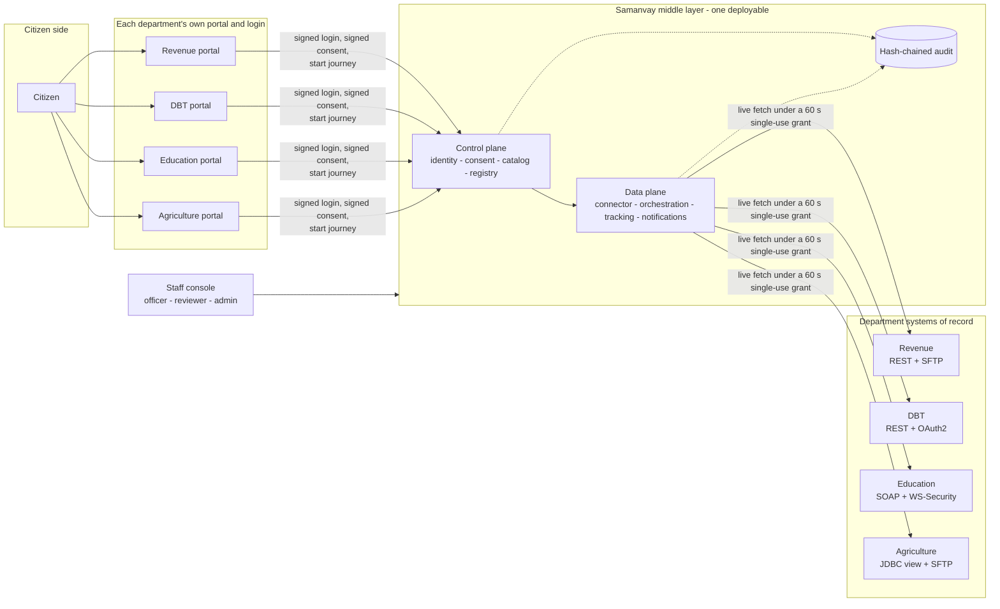
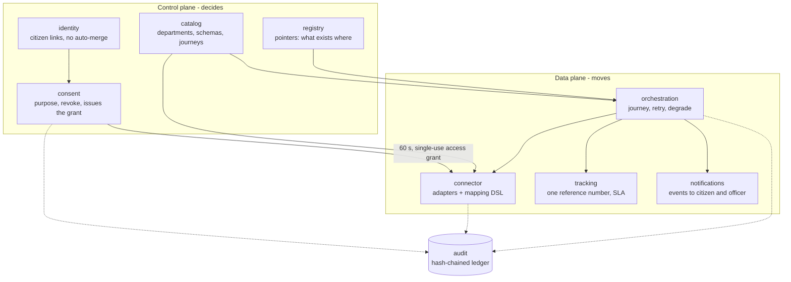
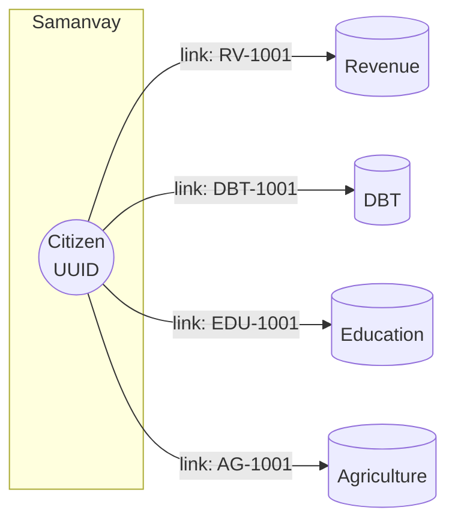
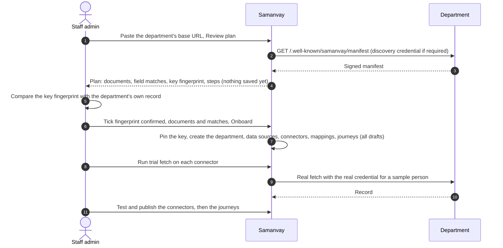
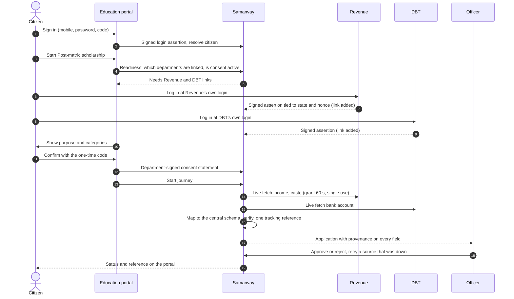
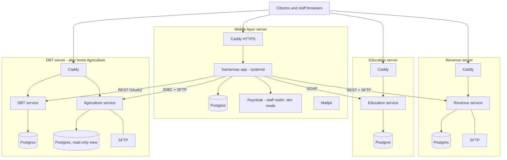

# Samanvay

**Government Digital Platform Interoperability & Federated Service Delivery Platform**

SIH26129 — *System integration and interoperability among government digital platforms,
resulting in fragmented service delivery* · Government of Maharashtra

---

> **The platform does not centralize government data. It makes distributed government data
> discoverable, accessible and interoperable under explicit authorization.**

Samanvay is an interoperability platform, not a service portal. Government departments keep
ownership of their data; Samanvay owns only the *interoperability state* — identity links,
consent, discovery metadata, workflow, tracking, audit and mappings.

Citizen journeys (post-matric scholarship, farmer subsidy, income certificate renewal, DBT bank account seeding) run on **each department's own
portal**, not on Samanvay: Samanvay has no citizen sign in and no citizen screens. The department's portal calls Samanvay behind the scenes, with
the citizen's consent (signed by the department). The journeys exist as **evidence that the platform is generic**, not as the product.

## Live demo & one-click access (for judges)

**Live:** <https://app.3.109.201.126.nip.io/app/> — demo data only; nothing here is a real record.

There is **no demo login**: everyone signs in through Keycloak.

- **Citizens** do not use Samanvay. They sign in on a department's own portal (`https://<department>/portal/`) with that department's
  mobile number, password and one-time code; when a service needs another department's records they log in at that department's own login.
- **Staff** use the ready-made accounts `dev-officer`, `dev-reviewer` and `dev-admin` (temporary password `<user>-change-me`):
  the first sign-in asks for a new password and for an authenticator code (TOTP) to be enrolled, as for any real staff
  account. A passkey also works.

**The four department portals** (each is the department's own citizen front door; a service starts here, not on Samanvay):

| Department | Portal | Service offered there | Protocol Samanvay uses to reach it |
|---|---|---|---|
| Revenue | <https://revenue.43.204.63.20.nip.io/portal/> | Income certificate renewal | REST + SFTP |
| DBT | <https://dbt.13.127.73.197.nip.io/portal/> | DBT bank account seeding | REST + OAuth2 |
| Education | <https://education.13.202.195.55.nip.io/portal/> | Post-matric scholarship | SOAP + WS-Security |
| Agriculture | <https://agriculture.13.127.73.197.nip.io/portal/> | Farmer subsidy | JDBC (read-only view) + SFTP |

Each portal signs in with a mobile number, that department's password and a one-time code. The demo citizens and their passwords are
issued by the maintainers and are not published here. A department's services only work once an admin has onboarded that department
(staff console, *Onboarding*), and a scholarship or farmer-subsidy application needs every department it draws from to be onboarded.

| Open this | Sign in as | What to look at |
|---|---|---|
| [`/app/#/staff/admin/onboarding`](https://app.3.109.201.126.nip.io/app/#/staff/admin/onboarding) | `dev-admin` | Onboard a department from just its URL; it picks up the department's documents **and its services (journeys)**; "Run trial fetch" |
| [`/app/#/staff/admin/schemas`](https://app.3.109.201.126.nip.io/app/#/staff/admin/schemas) | `dev-admin` | The **central schema** the departments' fields are matched onto; add a schema or a new version |
| [`/app/#/staff/admin/departments`](https://app.3.109.201.126.nip.io/app/#/staff/admin/departments) and [`/app/#/staff/admin/journeys`](https://app.3.109.201.126.nip.io/app/#/staff/admin/journeys) | `dev-admin` | The onboarded **Departments** and **Journeys**; each journey's **readiness** is computed from real connector availability; publish a ready one |
| [`/app/#/staff/officer/exceptions`](https://app.3.109.201.126.nip.io/app/#/staff/officer/exceptions) | `dev-officer` | Exception queue, retries, bank-account review, live ops metrics |
| [`/app/#/staff/reviewer/queue`](https://app.3.109.201.126.nip.io/app/#/staff/reviewer/queue) | `dev-reviewer` | The identity-matching review queue (machines propose, humans dispose) |

The `#` in the staff URLs matters — the app uses hash routing. The **citizen** experience is each department's own portal
(`/portal/` on the Revenue, DBT, Education and Agriculture servers; see `deploy/README.md`). Staff open **Journeys, then a journey's Status**
(`/app/#/staff/admin/journeys/<code>`) to see whether it is connected and working, with its middle-layer log.

## Contents

1. [The problem and the idea](#the-problem-and-the-idea)
2. [Architecture](#architecture)
3. [How a citizen is mapped across departments](#how-a-citizen-is-mapped-across-departments)
4. [The four departments: assumptions and workings](#the-four-departments-assumptions-and-workings)
5. [What a department has to implement](#what-a-department-has-to-implement)
6. [How a department is onboarded](#how-a-department-is-onboarded)
7. [How a journey runs end to end](#how-a-journey-runs-end-to-end)
8. [Decisions and trade-offs](#decisions-and-trade-offs)
9. [Feasibility, viability and what staff can see](#feasibility-viability-and-what-staff-can-see)
10. [How it is deployed today](#how-it-is-deployed-today)
11. [Internal working](#internal-working)
12. [Security and sensitivity](#security-and-sensitivity)
13. [Future scope, including where AI genuinely helps](#future-scope-including-where-ai-genuinely-helps)

## The problem and the idea

A Maharashtra citizen who applies for a scholarship needs an income certificate and a caste certificate (Revenue), a marks statement
(Education) and a verified bank account (DBT). Each of those lives in a different department system with a different protocol, a different
login and a different security scheme. Today the citizen carries paper between counters, or each department builds a bilateral integration
with every other one (N departments, up to N x N integrations).

Samanvay is the **middle layer** that removes that work without replacing any department system:

- Departments stay the **system of record**. Samanvay never stores a certificate, mark or bank number. It fetches live, under consent,
  and keeps only the *interoperability state*: who the citizen is at each department, what they consented to, how each department's fields map
  onto one central schema, the workflow, the tracking reference and a tamper-evident audit trail.
- A department joins by **publishing a manifest** (what it holds and how to reach it), not by changing its system. Onboarding is a few
  minutes of staff work, not an integration project.
- **Samanvay has no citizen screens.** The citizen stays on the department they already trust. The department's own portal calls Samanvay
  behind the scenes, and the department itself signs the citizen's consent.

## Architecture

### Where Samanvay sits



### Control plane decides, data plane moves



No data fetch happens without a grant that the control plane issued. The module boundaries are enforced at build time (Spring Modulith and
ArchUnit), so a data-plane class cannot reach into the control plane's tables.

### Stack

Java 21, Spring Boot 4 with Spring Modulith, PostgreSQL 16 and Flyway, Keycloak (staff only), Resilience4j, Flowable behind a port
(`WorkflowEngine`), React + TypeScript for the staff console and the department portal, Docker Compose, Caddy for HTTPS.

## How a citizen is mapped across departments

There is **no national ID** and no central citizen database. The same person has a different identifier at every department
(Revenue `RV-1001`, DBT `DBT-1001`, Education `EDU-1001`, Agriculture `AG-1001` in the demo). Samanvay holds a **citizen record of its own**
(a random UUID, a display name) and a set of **links** from that record to the person's local identifier at each department.



How a link is made, and why it can be trusted:

1. The citizen signs in **at a department** with that department's own login (mobile number, password, one-time code in the demo). The
   department's portal then asks Samanvay to *resolve* the citizen and sends a **signed login assertion** (ES256 JWT: department, local person
   ID, time, one-time `jti`, optionally name and date of birth). Samanvay verifies it against the department's **pinned signing key** and accepts
   each assertion once. A citizen record is created, or found, with a link to that department's person ID.
2. Later a service needs records from **another** department. The portal shows "Log in at Revenue". The citizen goes to Revenue's own login
   and comes back with a second signed assertion, tied to a one-time `state` and `nonce` that Samanvay issued for **this** citizen. Samanvay
   adds the second link to the same citizen. Nothing but proof of control of both accounts links them.
3. If the person had already signed in at the second department on its own, there are now two Samanvay records for one human. When a
   link proves they are the same person, the records are **merged** (links move to the surviving record, discovery pointers are re-created).
   A record with applications or consents is never merged silently.
4. Where the proof is weaker (a name and date-of-birth match without a login), the system only **proposes** a match. A human reviewer
   confirms or rejects it in the reviewer queue. Probabilistic matches never become active links on their own.

A department never learns the citizen's identifiers at another department: the readiness call returns only which departments are linked,
not the local IDs.

### Mapping documents onto one schema

The same idea applies to data. Each department names its fields differently (`annualIncome`, `income_inr`, `ANNUAL_INC`). Samanvay has a
**central schema per document type** (for example `Credential/Marks@1`, `Credential/Income@1`) that lists the fields a service needs and
which are required. When a department is onboarded, each of its document fields is **matched** to a central field (the system proposes
matches, an admin approves them). A connector then fetches over the department's protocol and a small mapping DSL converts the answer to the
central shape, so a journey is written once against the central schema and works with any department that provides that document.
The staff console's *Central schema* page shows, document by document, what the document contains and which onboarded department maps onto it.

## The four departments: assumptions and workings

These four are separate Spring Boot services in `departments/`, with their own data, protocols, security and login. They are **stand-ins with
fake data**, built to look the way real systems look, so the platform is proven against four genuinely different integration styles.

| | Revenue | DBT | Education | Agriculture |
|---|---|---|---|---|
| Documents | income, caste, domicile certificates; 7/12 land record | bank account | marks statement | farmer record; crop sowing record |
| Protocol | REST + SFTP batch CSV | REST | SOAP 1.1 | JDBC (read-only view) + SFTP batch CSV |
| What Samanvay must satisfy | `X-Api-Key` (+ optional IP allow-list); SFTP password and pinned host key | OAuth2 client credentials, bearer token | WS-Security UsernameToken in the SOAP header | database account that can read one view only; SFTP password and pinned host key |
| Citizen login | mobile + password + code | mobile + password + code | mobile + password + code | mobile + password + code |
| Journey it offers | Income certificate renewal | DBT bank account seeding | Post-matric scholarship | Farmer subsidy |
| Journey needs | income certificate | bank account | income + caste (Revenue), marks (Education), bank account (DBT) | land parcel (Revenue), crop record (Agriculture), bank account (DBT) |

### Assumptions we made about every department

- It already has an authoritative record per person and can look it up by its own person identifier.
- It can expose that record **read-only** in one of the four styles above, or already does for another system. We do not ask for a new API.
- It has its own citizen login and wants to **keep** it. We do not ask it to adopt a shared identity provider.
- It can publish one small signed document (the manifest) and keep one signing key.
- It can restrict who may read: give Samanvay a read-only credential, a key, an OAuth client or an IP allow-list.
- It is willing to confirm "this citizen is who they say" (signed login assertion) and "this citizen agreed to this use" (signed consent
  statement), because only the department can attest to its own login.
- A department's field names and formats are its own business. We map, we do not ask it to rename.

### Per department

**Revenue.** Certificates are keyed by the certificate number, not the person, so the manifest declares a **resolve** step: Samanvay first
calls `GET /v1/persons/{personId}/documents?type=...` to find the latest certificate key, then fetches `/v1/income/{key}`. The 7/12 land
extract is a **batch CSV** on Revenue's SFTP server, one row per person. Because a batch file is what many revenue systems really
produce, the connector reads it over SFTP with a **pinned host key** (no trust on first use). Revenue also demands a **discovery credential**
before it will show its manifest at all, to show that a department can restrict even the onboarding handshake.

**DBT.** A modern API. The connector first obtains an OAuth2 client-credentials token, then posts a lookup to `/v1/bank`. The answer
carries an account reference and a masked IFSC, never the full account number; Samanvay does not need it to decide eligibility. DBT is needed by three of the four
journeys, which is why it is the department most services depend on.

**Education.** A SOAP service with a WS-Security UsernameToken. The connector builds the SOAP envelope, adds the header and parses the XML
answer. It is the proof that Samanvay copes with an older enterprise protocol with no change on the department side.

**Agriculture.** The farmer record is not behind an API at all: the department gives Samanvay a **read-only database account** that can read
exactly one view. The manifest names the view and its key column and **no SQL**; Samanvay builds the fixed query itself, and a guard
refuses anything but a parameterised `SELECT`. The crop sowing record is another SFTP batch CSV.

## What a department has to implement

The goal is to keep this list small and mostly about **attesting**, not about integrating.

| # | What | Why | Effort |
|---|---|---|---|
| 1 | **Publish `GET /.well-known/samanvay/manifest`** (v2): documents with fields, how to reach each, the security *parameter names* (never values), whether a resolve step is needed, the journeys it offers, and an `identity` block (login URL, public keys, ID type) | Lets Samanvay onboard it from one URL | A static document plus a signing key |
| 2 | **Sign the manifest** (ES256, `X-Samanvay-Signature`, bound to the document hash, issue time and the department's own address) and keep the key | The admin pins the key fingerprint once; a changed manifest from anyone else is refused | One key file |
| 3 | **Keep serving its existing data** over REST, SOAP, SFTP or a read-only JDBC view, and issue Samanvay a read-only credential | Samanvay fetches live | None if it already exposes the data |
| 4 | **After its own login, send a signed login assertion** to Samanvay (`POST /api/department/citizens/resolve` with its client credentials) | This is how a citizen record gets linked to the department's person ID | One signed JWT per sign-in |
| 5 | **Show the consent wording and sign the citizen's confirmation** (a `samanvay-consent` JWS: purpose, categories, one-time nonce) | The department is the one party that can attest the citizen agreed | One signed statement per consent |
| 6 | **Offer its journey on its own portal** and call Samanvay to start it | The citizen never leaves the department they trust | The shared kit gives a ready portal |

For a Spring Boot department steps 4 to 6 are the shared library `departments/kit` (auto-configuration, session handling, sign-in throttling,
consent signing, the React portal). A department on another stack implements the same three small contracts
([department API](docs/contracts/department-api.md), [login assertion](docs/contracts/login-assertion.md),
[consent statement](docs/contracts/department-consent-statement.md), [manifest signature](docs/contracts/manifest-signature.md)).
What the department does **not** do: change its database, adopt a new identity system, build a citizen screen for Samanvay, expose a new
API, or share data in bulk.

## How a department is onboarded



What the operator provisions outside the console (the console lists each step in the plan): the department's read-only credential for each
data source, the SFTP host-key pin, the discovery credential if the department wants one, and the department portal's own Keycloak client
so it can call Samanvay. Secrets are never typed into the console and never stored in the database; they sit in the secret store.

A change to a department's manifest later is never silent. A new key fingerprint, a different login address or a changed host is shown
in the plan and needs an explicit confirmation.

The staff console then shows only what was really onboarded: **Departments** (sources, health, each document with its connector status,
last trial and how its fields map to the central schema), **Journeys** (readiness, counts, the log of each run) and **Central schema**
(document by document). Seeded demo rows are not shown.

## How a journey runs end to end



If a source is down, the application waits as **pending source** with an exception raised for an officer, and a retry fills the missing
document without restarting the citizen's journey. An application is verified only when every required document has been fetched.

## Decisions and trade-offs

| Decision | Why | What it costs |
|---|---|---|
| **Fetch live, never copy** | No central data lake, nothing to leak or keep in sync, consent revoke is immediate | A journey depends on departments being up (mitigated by pending-source state and retry) and is slower than a local read |
| **Departments keep their own login** | Citizens trust the door they know; no new identity system to roll out | Linking needs the citizen to log in at each department once per journey |
| **The department signs consent** | Only the department can attest its own login; consent is non-repudiable evidence in our ledger | The department must implement signing (the kit does it for Spring Boot) |
| **Samanvay has no citizen UI** | Smaller attack surface, no second front door, departments stay the face of the service | Each department needs a portal (reuses the shared one) |
| **Manifest-driven onboarding** | A new department is configuration plus an admin approval, not code | The manifest is a new thing for a department to publish and keep right |
| **Pin the department's signing key, confirmed by a human** | The one real trust decision happens once and visibly | An admin must verify the fingerprint out of band |
| **Machines propose, humans dispose** for identity matches | A wrong merge of two citizens is a serious harm | A reviewer queue to staff |
| **One central schema per document, mapped by a DSL** | Journeys are written once; a new department is a mapping | Someone has to approve the field matches |
| **Modular monolith (Spring Modulith) rather than microservices** | One deployable to run for a government pilot, boundaries still enforced at build time | Scaling units together; splitting later needs work |
| **Workflow engine behind a port** | A swap is real (BPMN today, a simple DAG if needed) | An extra interface |
| **Hash-chained audit** | Tamper-evident record for RTI and inquiry | Storage and a verification job |
| **Hide seeded demo rows instead of deleting them** | Hundreds of tests rely on them | The database still holds demo rows; production guards refuse to start with the mock departments published |
| **In-memory metrics** | Simple | Counters reset on restart (SLA and the exception queue are database-backed) |

## Feasibility, viability and what staff can see

**Why we think it is feasible.** The pilot proves the hard part: four departments with four different protocols and four different security
schemes are onboarded from a URL, with no change to their systems, and four journeys run across them. Adding a department or a service
is configuration. The departments' burden is a small set of signed documents; the platform carries the integration.

**Why it is viable for a state.** It avoids a fourth silo and a central data lake. The cost of adding the Nth department grows with N, not
N x N. It reuses what departments already run. Consent is explicit, purposeful, revocable and evidenced by the department's own signature.

**Risks we know about.** Real department APIs need MoUs and credentials. Real departments will each have quirks the four stand-ins do not.
The sign-in code and the in-memory throttles are demo shortcuts. A source that stays down creates an officer queue. Live DigiLocker and
Aadhaar integration need partner accounts.

**What staff can see (observability).** Staff sign in through Keycloak with a second factor.
- *Departments*: every onboarded department, its sources and health, every document with connector status, last trial and how it maps onto the central schema.
- *Journeys*: each journey's readiness (is every needed document available and working), running, approved and rejected counts, and the per-journey log with *Check source* and *Run trial* buttons.
- *Central schema*: each document, what it contains, and which department fills it.
- *Officer desk*: applications with the source of every field, SLA watchlist, exception queue with retries, a 360-degree view of one citizen (links, applications, consent and access trail).
- *Audit*: a hash-chained ledger of grants, fetches, retries and consent changes, with a *Verify chain* check.
- *Metrics*: SLA and exception queue (from the database); connector success and latency, consent decisions and notification delivery since the node started.

## How it is deployed today

A five-server demo on AWS (Mumbai), all with fake data and HTTPS through Caddy on `nip.io` names:



- The middle layer is one Spring Boot jar run by systemd, with Postgres, Keycloak (staff realm only) and Mailpit in Docker.
- Each department is its own Docker Compose project with its own Postgres, built from `departments/`. Agriculture shares the DBT server
  because the account's vCPU quota was full; it is a separate compose project behind the same Caddy.
- Staff sign in with a password and a second factor. Citizens sign in only on a department's own portal.
- It is a **demo**: Keycloak is in dev mode (its users reset when recreated), the one-time code is fixed, and the sign-in codes are visible.
  See [deploy/README.md](deploy/README.md) for everything an operator does, and the safe-by-default rules that stop the demo settings from
  reaching production.

## Internal working

- **Modules.** `audit`, `catalog`, `identity`, `registry`, `consent`, `connector`, `orchestration`, `tracking`, `notifications`, plus
  `ops` (read-only staff views). Each module exposes a small `api` package; everything else is `internal`, enforced by tests.
- **Consent and the grant.** A journey asks `consent` whether the requester may read a category for a purpose. If so, `consent` issues a
  60-second, single-use **access grant**. The `connector` refuses to fetch without one, and it is used up by the fetch.
- **Connector.** An adapter per protocol (REST, SOAP, SFTP CSV, JDBC) with deadlines, retry, circuit breaker and bulkhead
  (Resilience4j). A mapping DSL turns the department's answer into the central schema. Manifest paths, hosts and redirects are validated so a
  manifest cannot send a credential somewhere else.
- **Orchestration.** A journey is a workflow over its required documents. Each document is a step; steps run in parallel; a failed or
  unavailable source leaves the step *pending source* with an exception for an officer; the application is verified only when every step is complete.
  Terminal states cannot be overwritten; a second open start for the same citizen and journey is refused.
- **Tracking.** One reference number, SLA due time, status, and an officer approval that triggers the DBT disbursement.
- **Registry.** Pointers only: which department holds what for a citizen, never the content.
- **Audit.** Every grant, fetch, retry, consent change and link is a row whose hash includes the previous row. Changing any row breaks
  the chain and *Verify chain* fails. The application's database role cannot update or delete audit rows.
- **Department side.** The shared kit supplies the portal back end, a stateless signed session cookie, sign-in throttling, request hygiene
  (a path containing `;` or dot segments is rejected, everything is protected except an explicit public list), manifest signing and consent signing.

## Security and sensitivity

- **Least data.** Nothing but interoperability state is stored. A fetch returns only the fields the central schema asks for, with the
  department as provenance. The readiness call never reveals a citizen's identifiers at other departments.
- **Consent is purpose-bound and revocable.** Each consent names the requester, the purpose and the categories. A revoke stops the next fetch.
  Sensitive categories (caste, bank account) are consent-gated, and the bank answer is masked.
- **Who vouches for whom.** The department signs the login and the consent; Samanvay verifies against a key a human pinned. Replays are
  blocked with one-time `jti`, `state` and `nonce` values. A department can only start journeys it runs, for citizens linked to it.
- **Staff access.** Keycloak with a second factor, roles for officer, reviewer and admin, and every `/api` route listed in a test with the
  roles allowed. Department clients are separate and scoped to their own data sources.
- **Defence in depth on onboarding.** Pinned key, confirmed fingerprint, signed manifest bound to the department's address, validated
  endpoint paths, a guard against calls to private network addresses, SFTP host-key pins.
- **Audit.** A tamper-evident ledger answers "who asked for what, when, for which purpose" without storing the data itself.
- **Safe by default.** Services refuse to start on default passwords, demo codes or mock departments outside the demo profiles.

## Future scope, including where AI genuinely helps

**Platform**
- Real departments: MoUs, real credentials, DigiLocker as a consent pipe for issued copies, Aadhaar-based e-KYC where lawful.
- More protocols and styles (event streams, file drop with checksums), more journeys, each as a manifest plus mapping.
- A consent dashboard for citizens (inside the departments' portals), notifications by SMS and WhatsApp.
- Pooled, durable sessions and rate limiting (Redis), multi-instance Samanvay, an external witness for the audit chain, key rotation and
  hardware-backed keys, per-department quotas.
- Department self-service onboarding with a test harness that runs the contracts against a department before an admin sees it.

**Security and sensitivity in the future.** As real records arrive, the platform's value is its *restraint*: field-level minimisation per
purpose, retention that ends with the purpose, purpose limitation checked in code, break-glass access that is itself audited, data-protection
impact assessments per journey, and alignment with the DPDP Act (permission handling, grievance and erasure flows). Sensitive categories (caste,
health, bank) get stricter policy: step-up consent, shorter grant lifetimes, officer access only with a reason.

**Where AI could genuinely help.** We would only use AI where it assists a human or removes toil, never to decide an entitlement or to link two people.
1. **Mapping suggestions at onboarding.** Propose which department field matches which central field from names, samples and descriptions, with a confidence score and the reasoning; an admin approves. (The current matcher is a simple similarity score.)
2. **Manifest and contract linting.** Read a department's API docs or WSDL and draft the manifest, then flag a manifest that has drifted from the live service.
3. **Document intake for batch sources.** Extract fields from scanned or non-uniform certificates into the central schema for departments that only have paper or PDFs, with human review.
4. **Identity candidate triage.** Rank and explain probable duplicate citizens (transliteration of Marathi and English names, date formats) for the reviewer. The reviewer still decides.
5. **Anomaly detection on the audit trail.** Spot a department or officer reading unusually, a burst of failed assertions, or a source whose answers suddenly change shape.
6. **Officer assistance.** Summarise an application's evidence and gaps, draft a plain-language request for a missing document, and explain a rejection to a citizen in Marathi, Hindi or English.
7. **Citizen help on the department portal.** A multilingual assistant that explains what a service needs and where the citizen is stuck, with no access to their data beyond the session.
8. **Operations.** Explain a failing journey from its log and suggest the fix.

Where AI should not be used: deciding eligibility, creating or merging an identity link, or approving a disbursement. Those stay rules
and humans, with the audit trail to prove it.


## Design principles

| | |
|---|---|
| **P1** | Federated by default, indexed centrally |
| **P2** |The control plane decides, the data plane moves|
| **P3** | Machines propose, humans dispose, the decision is audited |
| **P4** | The canonical model is a transport contract, not ownership |
| **P5** | Concrete, then generalize, then prove |
| **P6** | Depend on capabilities only where a swap is real |

## Documentation

| Document | Contents |
|---|---| 
| [docs/architecture/HLD.md](docs/architecture/HLD.md) | **High Level Design — combined.** Single source of truth for principles, flows and technology decisions |
| [docs/architecture/hld/](docs/architecture/hld/README.md) | High Level Design — one charter per module, plus the dependency graph |
| [docs/architecture/LLD.md](docs/architecture/LLD.md) | **Low Level Design — combined.** Package layout, DB conventions, error handling, testing, cross-module sequence diagrams |
| [docs/architecture/lld/](docs/architecture/lld/README.md) | Low Level Design — one document per module: DDL, class design, sequences, tests |
| [docs/FINAL-CHANGES.md](docs/FINAL-CHANGES.md) | The department-services redesign: decisions, build log and what is still open |
| [docs/contracts/login-assertion.md](docs/contracts/login-assertion.md) | The signed assertion a department login returns (how a citizen proves who they are there) |

### Modules

| # | Module | Plane | Phase | HLD | LLD |
|---|---|---|---|---|---|
| 01 | `audit` | Cross-cutting | 0 | [charter](docs/architecture/hld/01-audit.md) | [LLD](docs/architecture/lld/01-audit.md) |
| 02 | `catalog` | Control | 1 | [charter](docs/architecture/hld/02-catalog.md) | [LLD](docs/architecture/lld/02-catalog.md) |
| 03 | `identity` | Control | 1 → 2 | [charter](docs/architecture/hld/03-identity.md) | [LLD](docs/architecture/lld/03-identity.md) |
| 04 | `registry` | Control | 1 → 2 | [charter](docs/architecture/hld/04-registry.md) | [LLD](docs/architecture/lld/04-registry.md) |
| 05 | `consent` + `AccessAuthority` | Control | 1 | [charter](docs/architecture/hld/05-consent.md) | [LLD](docs/architecture/lld/05-consent.md) |
| 06 | `connector` | Data | 1 → 2 | [charter](docs/architecture/hld/06-connector.md) | [LLD](docs/architecture/lld/06-connector.md) |
| 07 | `orchestration` | Data | 1 → 2 | [charter](docs/architecture/hld/07-orchestration.md) | [LLD](docs/architecture/lld/07-orchestration.md) |
| 08 | `tracking` | Data | 1 | [charter](docs/architecture/hld/08-tracking.md) | [LLD](docs/architecture/lld/08-tracking.md) |
| 09 | `notifications` | Data | 2 | [charter](docs/architecture/hld/09-notifications.md) | [LLD](docs/architecture/lld/09-notifications.md) |

## Stack

**Backend** Java 21 · Spring Boot 4 (Spring Framework 7) · Spring Modulith 2.x ·
PostgreSQL 16 · Flowable 8.x (behind a port) · Keycloak · Resilience4j · Flyway

**Frontend** One React + TypeScript + Vite project (`frontend/`) with two builds: the staff console (officer desk, reviewer queue, admin
onboarding, catalog and journey status), served by Spring at `/app/`; and the **department citizen portal**, built by `scripts/build-portal.sh`
into each department service's `static/portal/`. A few thin static pages remain for operations (`/demo.html` and friends).

**Runtime** Docker Compose — fully offline, deterministic seed data

## Getting started

Requires: Java 21+ (JDK 25 works fine — Maven compiles down to release 21), Docker Desktop. No Maven install needed, the wrapper handles it.

```bash
./mvnw -DskipTests package   # also builds the Keycloak email-code provider (target/keycloak-providers)
docker compose up -d          # Postgres + dev Keycloak (http://localhost:8180, admin/admin) + Mailpit (http://localhost:8025)
./mvnw spring-boot:run -Dspring-boot.run.arguments=--spring.profiles.active=demo
```

Use the `dev` or `demo` profile locally: only those two point at the compose Keycloak
(`http://localhost:8180`, see `application-dev.yml`). Any other boot refuses to start unless
`SAMANVAY_STAFF_ISSUER_URI` and `SAMANVAY_CITIZEN_ISSUER_URI` are set to https issuers.

Every `/api/**` call needs a Keycloak bearer token (the actor is taken only from the token).
Pages have a sign-in bar (Authorization Code + PKCE; the issuer and client come from
`GET /ui/auth-config`). There is no demo or paste-token sign-in in any profile. Dev realms are imported from
`keycloak/realms/` (regenerate with `python3 keycloak/gen_realms.py`; set `SAMANVAY_EXTRA_ORIGINS` to add a deployed
https origin; the default is the AWS demo's, so regenerating reproduces the committed files):

| Realm | Dev users | Sign-in |
|---|---|---|
| `samanvay-staff` | `dev-officer` (department `SCHOLARSHIP`), `dev-reviewer`, `dev-admin`; temporary password `<user>-change-me` | passkey (user verification required) **or** password + TOTP; no password-only path |
| `samanvay-citizen` | `dev-citizen` / `dev-citizen-change-me`, or sign up | email + password (sign-up asks for first name, last name, email, password; email is the user name) **or** passkey; no TOTP; direct grants denied |

Department service accounts (client credentials, secret generated by Keycloak, read it in the admin console) get
`ROLE_DEPARTMENT` plus one `source:<code>` scope per data source: `dept-revenue`, `dept-dbt`, `dept-education`,
`dept-agriculture` (the clients the onboarding plan's "Issue caller credential" step names) and the older
`dept-scholarship-dev`.
Issuers are configurable with `SAMANVAY_STAFF_ISSUER_URI` / `SAMANVAY_CITIZEN_ISSUER_URI`.

Staff entry: `http://localhost:8080/` is a short landing page for the Samanvay team and officers, linking to the staff console at `/app/`.

| URL | What it is |
|---|---|
| `/` | Staff landing page |
| `/app/` | Staff console (officer, reviewer, admin) |
| `/demo.html` | Optional Samanvay operations cutaway |
| `http://localhost:8091..8094/portal/` | Revenue, DBT, Education, Agriculture citizen portals (the department services, run locally) |

Spoken eight-minute walk: [docs/demo/JUDGE_SCRIPT.md](docs/demo/JUDGE_SCRIPT.md). One-pager: [docs/demo/ONE_PAGER.md](docs/demo/ONE_PAGER.md). Technical rehearsal: [docs/demo/PHASE4_RUNBOOK.md](docs/demo/PHASE4_RUNBOOK.md).

Samanvay remains the interoperability middle layer. The department portals are its callers, not the product. (The older judge script under
`docs/demo/` describes the previous Samanvay-hosted portals and is out of date.)

## Department services: four separate stand-in departments (dev/demo only)

`departments/` holds **four separate department services** (Revenue, DBT, Education, Agriculture), each its own Spring Boot
app with its own fake data, its own protocols and security, its own published manifest, and its own citizen login. Samanvay
learns each one from its manifest and onboards it in one go; it never holds their documents.

| Dept | Port | Documents | Protocols | Security Samanvay satisfies | Citizen login |
|---|---|---|---|---|---|
| `revenue/` | 8091 | income / caste / domicile certificates (own keys, so a `resolve` step), 7/12 land parcel | REST + SFTP | API key (+ optional IP allow-list); SFTP password | mobile + password + code |
| `dbt/` | 8092 | bank account | REST | OAuth2 client credentials | mobile + password + code |
| `education/` | 8093 | marks | SOAP | WS-Security UsernameToken | mobile + password + code |
| `agriculture/` | 8094 | farmer record (DB view), crop record | JDBC + SFTP | read-only DB account; SFTP password | mobile + password + code |

How it fits together (details and decisions: [docs/FINAL-CHANGES.md](docs/FINAL-CHANGES.md)):

1. **Manifest.** Each department publishes `GET /.well-known/samanvay/manifest` (v2): documents, how to reach each over its
   protocol, the security parameters it needs (names only, never values), whether a `resolve` step is needed, its journeys,
   and an `identity` block for its login.
2. **One-go onboarding.** `POST /api/catalog/onboard/plan` reads the manifest and returns a plan (nothing changes);
   `POST /api/catalog/onboard` creates the department, data sources, connectors, mappings and journeys as drafts, in one
   transaction, for exactly the documents an admin ticked (refused if the manifest changed since). Field matches are proposals an
   admin approves. The staff console has the screen: **Onboard a department in one go**. Secrets and SFTP/JDBC hosts stay with the
   operator: the plan lists each step (provision a secret, pin a host key, issue the department portal a caller credential).
3. **Central schema stays seeded** (V203): a department's document types are seeded first, then its fields are mapped onto them.
4. **Linking is per department, by that department's own login.** The citizen logs in at the department; it returns a signed
   assertion ([contract](docs/contracts/login-assertion.md)); Samanvay verifies it and saves the link. Later journeys need
   only consent.
5. **Fetching** sends the person ID (or the document key from the optional `resolve` step) plus Samanvay's credentials over the
   declared protocol.

Run one: `./mvnw -f departments/pom.xml -pl revenue -am spring-boot:run -Dspring-boot.run.profiles=dev` (the `dev` profile turns on demo mode; without it a department refuses to start on the dev default secrets). Run all with their data stores:
`docker compose up -d dept-revenue dept-dbt dept-education dept-agriculture revenue-sftp agriculture-db agriculture-sftp`.
More: [departments/README.md](departments/README.md).

## Department simulators (dev/CI only)

> **The shared sandbox department is gone.** `simulators/` used to also serve a fake income / marks / bank "department" on one
> service. The four separate [department services](#department-services-four-separate-stand-in-departments-devdemo-only) in
> `departments/` replace it; see [docs/runbooks/department-cutover.md](docs/runbooks/department-cutover.md). `simulators/` now holds
> only the bank-check simulator below, which core's bank verification still uses.

`simulators/` is a **separate** Spring Boot app (own `pom.xml`, package `in.samanvay.simulators`,
port 8090). It stands in for external department APIs. The first one implements our own
[bank-check contract v1](docs/contracts/bank-check-v1.yaml): a public IFSC lookup plus a one-call account
check that returns only `accountStatus` and `nameMatch`, never the holder's name. Its fixtures are
described in [`SPEC-NOTES.md`](simulators/src/main/resources/fixtures/SPEC-NOTES.md).

```bash
./mvnw -f simulators/pom.xml spring-boot:run        # http://localhost:8090
curl localhost:8090/SBIN0000300                     # IFSC lookup (public, open RBI data)
curl -u samanvay-sim-key:sim-secret-change-me -H 'Content-Type: application/json' \
  -d '{"ifsc":"SBIN0000300","accountNumber":"00001000000001","applicantName":"Asha Patil"}' \
  localhost:8090/v1/bank-checks
```

The simulator is **never a live source in production**. samanvay-core has no build dependency on it and
reaches it only over HTTP, through the same client it will use for the live API. Every simulator
response carries `X-Samanvay-Simulator: true`. Which endpoint a source uses will be selected by
`samanvay.sources.<code>.mode=sandbox|simulator|live`, which comes in a separate PR.

### Property (SFTP) and pollution (JDBC) fixtures for the licence journey

REST and SOAP are served by the [department services](#department-services-four-separate-stand-in-departments-devdemo-only). Two more
compose services keep the licence journey's **SFTP** (property) and **JDBC** (pollution) sources on real transports, each with FAKE
sandbox data (never a real system):

- **`department-db`** (Postgres, `:5433`) — the **JDBC** source `sandbox-pollution-jdbc` (catalog V198). Seeded
  by `docker/department-db/init.sql` with a `pcb_clearance` table and a read-only role `pcb_ro`. A fetch runs a
  parameterized `SELECT` through the real `JdbcQueryClient` (`JdbcSqlGuard` permits SELECT only).
- **`department-sftp`** (`atmoz/sftp`, `:2222`) — the **SFTP** source `sandbox-property-sftp` (catalog V193).
  Serves `docker/department-sftp/property.csv` over real SFTP through `SftpCsvClient`.

Credentials are read from `SecretStore`, never from config. In the dev/demo profile (`EnvSecretStore`) that means
one env var per source, base64 of `username:password`:

```bash
docker compose up -d department-db department-sftp        # plus the base services

# JDBC read-only credential  (pcb_ro:pcb_ro_demo)
export SAMANVAY_SECRET_SOURCE_SANDBOX_POLLUTION_JDBC_CREDENTIAL="$(printf 'pcb_ro:pcb_ro_demo' | base64)"
# SFTP credential            (fixtureuser:fixturepass)
export SAMANVAY_SECRET_SOURCE_SANDBOX_PROPERTY_SFTP_CREDENTIAL="$(printf 'fixtureuser:fixturepass' | base64)"

# SFTP host key is pinned (no trust-on-first-use). Capture the running server's fingerprint once.
# Use the RSA key: the SftpCsvClient (Apache MINA sshd) negotiates rsa-sha2 with atmoz/sftp, so the
# pin must be that key's fingerprint (an ed25519 pin would fail with "Server key did not validate").
export SAMANVAY_SANDBOX_SFTP_HOSTKEY="$(ssh-keyscan -t rsa -p 2222 localhost 2>/dev/null \
  | ssh-keygen -lf - | awk '{print $2}')"

./mvnw spring-boot:run -Dspring-boot.run.arguments=--spring.profiles.active=demo
```

A fetch through `ConnectorRuntimeImpl` for `sandbox-pollution@1` / `sandbox-property@1` is then a real JDBC query /
SFTP download. Locally verifiable without Docker: `JdbcRealTransportTest` (H2) and `SftpCsvRealTransportTest`
(in-process sshd) prove the same code paths, and the `*BootTest`s prove a LIVE source refuses to start without its
credential.

## Contributing

1. Branch off `main`, work in your module's package (`com.samanvay.<module>.*`).
2. Open a PR against `main`. CI must pass; the technical lead's review is required (enforced via [CODEOWNERS](CODEOWNERS) and branch protection — direct pushes to `main` are blocked).
3. Read your module's charter in [`docs/architecture/hld/`](docs/architecture/hld/README.md) before writing code — it defines what your module owns, its public interface, and its acceptance criteria.
